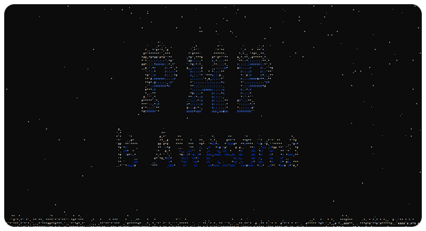

# PHP Terminal Snow Toy

Simple PHP app producing a snow in the terminal.

<p align="center">
  
</p>

### Quick run

```shell
docker pull mmmostrowski/php-snow && docker run -it --rm mmmostrowski/php-snow
```

#### Run custom scene
```shell
docker run -it --rm mmmostrowski/php-snow https://raw.githubusercontent.com/mmmostrowski/php-snow/main/app/assets/scene-example.txt massiveSnow
```

### Send a Postcard to your friend!

---

You can provide custom scenes in a plain text format:
 1. You might [want to use](https://www.google.com/search?q=ASCII+text+Generator+site) some ASCII Text Generator site for that purpose.
 2. Then you would need to encode text scene file in a [base64 format](https://www.google.com/search?q=base64+encode+online).
 3. Send a Docker command to your friend. Example:
```shell
docker run -it --rm mmmostrowski/php-snow base64:ICAgICAgICAgICAgICAgICAgICAgICAgICAgICAgICAgICAgICAgICAgICAgICAgICAgICAgICAgICAgICAgICAgICAgICAgICAgICAgICAKICAgICAgICAgICAgICAgICAgICAgICAgICAgICAgICAgICoqKioqKioqKioqKiogICAgICAgICAgICAgICAgICAgICAgICAgICAgICAgICAKICAgICAgICAgICAgICAgICAgICAgICAgICAqKioqKioqKioqKioqKioqKioqKioqKioqKioqKiAgICAgICAgICAgICAgICAgICAgICAgICAKICAgICAgICAgICAgICAgICAgICAgKioqKioqKioqICAgICAgICAgKioqICAgICAgICAgKioqKioqKioqICAgICAgICAgICAgICAgICAgICAKICAgICAgICAgICAgICAgICAqKioqKioqICAgICAgICAgICAgICAgKioqICAgICAgICAgICAgICAgKioqKioqKiAgICAgICAgICAgICAgICAKICAgICAgICAgICAgICAqKioqKiogICAgICAgICAgICAgICAgICAgKioqICAgICAgICAgICAgICAgICAgICoqKioqKiAgICAgICAgICAgICAKICAgICAgICAgICAgKioqKiogICAgICAgICAgICAgICAgICAgICAqKioqKiAgICAgICAgICAgICAgICAgICAgICoqKioqICAgICAgICAgICAKICAgICAgICAgICoqKioqICAgICAgICAgICAgICAgICAgICAgICAqKioqKiAgICAgICAgICAgICAgICAgICAgICAgKioqKiogICAgICAgICAKICAgICAgICAqKioqKiAgICAgICAgICAgICAgICAgICAgICAgICAqKioqKiogICAgICAgICAgICAgICAgICAgICAgICAqKioqKiAgICAgICAKICAgICAgICoqKiogICAgICAgICAgICAgICAgICAgICAgICAgICoqKioqKiogICAgICAgICAgICAgICAgICAgICAgICAgICoqKiogICAgICAKICAgICAgKioqKiAgICAgICAgICAgICAgICAgICAgICAgICAgICoqKioqKiogICAgICAgICAgICAgICAgICAgICAgICAgICAqKioqICAgICAKICAgICAqKioqICAgICAgICAgICAgICAgICAgICAgICAgICAgKioqKioqKioqICAgICAgICAgICAgICAgICAgICAgICAgICAgKioqKiAgICAKICAgICoqKiogICAgICAgICAgICAgICAgICAgICAgICAgICAgKioqKioqKioqICAgICAgICAgICAgICAgICAgICAgICAgICAgICoqKiogICAKICAgKioqKiAgICAgICAgICAgICAgICAgICAgICAgICAgICAgKioqKioqKioqICAgICAgICAgICAgICAgICAgICAgICAgICAgICAqKioqICAKICAgKioqKiAgICAgICAgICAgICAgICAgICAgICAgICAgICAqKioqKioqKioqKiAgICAgICAgICAgICAgICAgICAgICAgICAgICAqKioqICAKICAgKioqICAgICAgICAgICAgICAgICAgICAgICAgICAgICoqKioqKioqKioqKiogICAgICAgICAgICAgICAgICAgICAgICAgICAgKioqICAKICAqKioqICAgICAgICAgICAgICAgICAgICAgICAgICoqKioqKioqKioqKioqKioqKiogICAgICAgICAgICAgICAgICAgICAgICAgKioqLiAKICAgKioqICAgICAgICAgICAgICAgICAgICAgICoqKioqKioqKioqKioqKioqKioqKioqKiogICAgICAgICAgICAgICAgICAgICAgKioqICAKICAgKioqKiAgICAgICAgICAgICAgICAgICoqKioqKioqKioqKioqKioqKioqKioqKioqKioqKiogICAgICAgICAgICAgICAgICAqKioqICAKICAgKioqKiAgICAgICAgICAgICAgICoqKioqKioqKioqKioqKiogICAgICAqKioqKioqKioqKioqKioqICAgICAgICAgICAgICAqKioqICAKICAgICoqKiogICAgICAgICAgKioqKioqKioqKioqKiAgICAgICAgICAgICAgICAgICAqKioqKioqKioqKioqICAgICAgICAgICoqKiogICAKICAgICAqKioqICAgICAgKioqKioqKioqKiAgICAgICAgICAgICAgICAgICAgICAgICAgICAgICAqKioqKioqKioqICAgICAgKioqKiAgICAKICAgICAgKioqKiAgKioqKioqKiAgICAgICAgICAgICAgICAgICAgICAgICAgICAgICAgICAgICAgICAgICAqKioqKioqICAqKioqICAgICAKICAgICAgICoqKioqKiAgICAgICAgICAgICAgICAgICAgICAgICAgICAgICAgICAgICAgICAgICAgICAgICAgICAgICAqKioqKiogICAgICAKICAgICAgICAqKioqKiAgICAgICAgICAgICAgICAgICAgICAgICAgICAgICAgICAgICAgICAgICAgICAgICAgICAgICAqKioqKiAgICAgICAKICAgICAgICAgICoqKioqICAgICAgICAgICAgICAgICAgICAgICAgICAgICAgICAgICAgICAgICAgICAgICAgICAgKioqKiogICAgICAgICAKICAgICAgICAgICAgKioqKiogICAgICAgICAgICAgICAgICAgICAgICAgICAgICAgICAgICAgICAgICAgICAgICoqKioqICAgICAgICAgICAKICAgICAgICAgICAgICAqKioqKiogICAgICAgICAgICAgICAgICAgICAgICAgICAgICAgICAgICAgICAgICoqKioqKiAgICAgICAgICAgICAKICAgICAgICAgICAgICAgICAqKioqKioqICAgICAgICAgICAgICAgICAgICAgICAgICAgICAgICAgKioqKioqKiAgICAgICAgICAgICAgICAKICAgICAgICAgICAgICAgICAgICAgKioqKioqKioqICAgICAgICAgICAgICAgICAgICAgKioqKioqKioqICAgICAgICAgICAgICAgICAgICAKICAgICAgICAgICAgICAgICAgICAgICAgICAqKioqKioqKioqKioqKioqKioqKioqKioqKioqKiAgICAgICAgICAgICAgICAgICAgICAgICAKICAgICAgICAgICAgICAgICAgICAgICAgICAgICAgICAgICoqKioqKioqKioqKiogICAgICAgICAgICAgICAgICAgICAgICAgICAgICAgICA= windy
```

---

Alternatively you can make your scene file available publicly. Example:
```shell
docker run -it --rm mmmostrowski/php-snow https://domain.com/url/to/scene.txt [preset]
```

### Presets

There are a couple of presets available:
* `classical`
* `calm`
* `windy`
* `snowy`
* `massiveSnow`
* `noSnow`
* `noWind`
* `noGravity`
* `testPerformance`
* `testWind`

To run a preset simply add the preset code to the end of the command. E.x.:
```shell
docker run -it --rm mmmostrowski/php-snow snowy
```


### Run and Develop locally

* On _Linux_ and _MacOs_:
  ```shell
  ./run
  ``` 
* On _Windows_:
  ```shell
  run
  ```
* In a PHP terminal:
  ```shell
  run devbox
  devbox# php snow.php
  ```
* When no _Docker Engine_ available:
  ```shell
  cd app/
  composer install
  php snow.php
  ```
