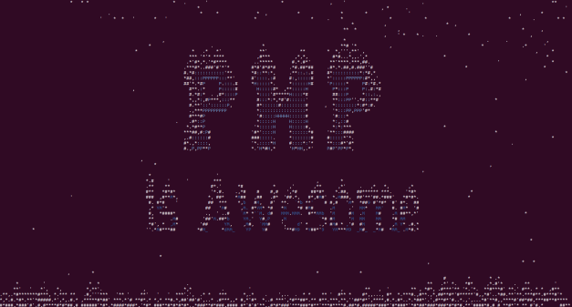

# PHP Terminal Snow Toy

Simple PHP app generating a snow in the terminal.

<p align="center">
  
</p>

### Quick run

```shell
docker pull mmmostrowski/php-snow && docker run -it --rm mmmostrowski/php-snow
```

#### Run custom scene
```shell
docker pull mmmostrowski/php-snow \
    && docker run -it --rm mmmostrowski/php-snow \
         https://raw.githubusercontent.com/mmmostrowski/php-snow/main/scene-example.txt \
         massiveSnow
```


### Run locally 
* On Linux and MacOs - simply clone the repository and run: 
  ```shell
  ./run.sh
  ``` 
* On Windows - simply clone the repository and run:
  ```shell
  run.bat
  ``` 
### Presets

There are a couple of presets available:
* `classical`
* `calm`
* `windy`
* `snowy`
* `massiveSnow`
* `noSnow`
* `noWind`
* `noGravity`
* `testPerformance`
* `testWind`

To run a preset simply add the preset code to the end of the command. E.x.:
```shell
docker run -it --rm mmmostrowski/php-snow snowy
```


### Custom scene 

You can provide custom scenes in a plain text format:

* Generate your custom text file
  * You might [want to use](https://www.google.com/search?q=ASCII+text+Generator+site) some ASCII Text Generator site for that purpose
* Run: 
```shell
docker run -it --rm --volume /path/to/your/scene.txt:/app/scene.txt mmmostrowski/php-snow 
```
* or, clone the project and then simply run:
```shell
./run.sh /path/to/your/scene.txt [preset]
```


### Send a Postcard to your friend!

You can encode your text scene file in a [base64 format](https://www.google.com/search?q=base64+encode+online), and send a Docker command to your friend: 
```shell
docker run -it --rm mmmostrowski/php-snow base64:ICAgICAgICAgICAgICAgICAgICAgICAgICAgICAgICAgICAgICAgICAgICAgICAgICAgICAgICAgICAgICAgICAgICAgICAgICAgICAgICAKICAgICAgICAgICAgICAgICAgICAgICAgICAgICAgICAgICoqKioqKioqKioqKiogICAgICAgICAgICAgICAgICAgICAgICAgICAgICAgICAKICAgICAgICAgICAgICAgICAgICAgICAgICAqKioqKioqKioqKioqKioqKioqKioqKioqKioqKiAgICAgICAgICAgICAgICAgICAgICAgICAKICAgICAgICAgICAgICAgICAgICAgKioqKioqKioqICAgICAgICAgKioqICAgICAgICAgKioqKioqKioqICAgICAgICAgICAgICAgICAgICAKICAgICAgICAgICAgICAgICAqKioqKioqICAgICAgICAgICAgICAgKioqICAgICAgICAgICAgICAgKioqKioqKiAgICAgICAgICAgICAgICAKICAgICAgICAgICAgICAqKioqKiogICAgICAgICAgICAgICAgICAgKioqICAgICAgICAgICAgICAgICAgICoqKioqKiAgICAgICAgICAgICAKICAgICAgICAgICAgKioqKiogICAgICAgICAgICAgICAgICAgICAqKioqKiAgICAgICAgICAgICAgICAgICAgICoqKioqICAgICAgICAgICAKICAgICAgICAgICoqKioqICAgICAgICAgICAgICAgICAgICAgICAqKioqKiAgICAgICAgICAgICAgICAgICAgICAgKioqKiogICAgICAgICAKICAgICAgICAqKioqKiAgICAgICAgICAgICAgICAgICAgICAgICAqKioqKiogICAgICAgICAgICAgICAgICAgICAgICAqKioqKiAgICAgICAKICAgICAgICoqKiogICAgICAgICAgICAgICAgICAgICAgICAgICoqKioqKiogICAgICAgICAgICAgICAgICAgICAgICAgICoqKiogICAgICAKICAgICAgKioqKiAgICAgICAgICAgICAgICAgICAgICAgICAgICoqKioqKiogICAgICAgICAgICAgICAgICAgICAgICAgICAqKioqICAgICAKICAgICAqKioqICAgICAgICAgICAgICAgICAgICAgICAgICAgKioqKioqKioqICAgICAgICAgICAgICAgICAgICAgICAgICAgKioqKiAgICAKICAgICoqKiogICAgICAgICAgICAgICAgICAgICAgICAgICAgKioqKioqKioqICAgICAgICAgICAgICAgICAgICAgICAgICAgICoqKiogICAKICAgKioqKiAgICAgICAgICAgICAgICAgICAgICAgICAgICAgKioqKioqKioqICAgICAgICAgICAgICAgICAgICAgICAgICAgICAqKioqICAKICAgKioqKiAgICAgICAgICAgICAgICAgICAgICAgICAgICAqKioqKioqKioqKiAgICAgICAgICAgICAgICAgICAgICAgICAgICAqKioqICAKICAgKioqICAgICAgICAgICAgICAgICAgICAgICAgICAgICoqKioqKioqKioqKiogICAgICAgICAgICAgICAgICAgICAgICAgICAgKioqICAKICAqKioqICAgICAgICAgICAgICAgICAgICAgICAgICoqKioqKioqKioqKioqKioqKiogICAgICAgICAgICAgICAgICAgICAgICAgKioqLiAKICAgKioqICAgICAgICAgICAgICAgICAgICAgICoqKioqKioqKioqKioqKioqKioqKioqKiogICAgICAgICAgICAgICAgICAgICAgKioqICAKICAgKioqKiAgICAgICAgICAgICAgICAgICoqKioqKioqKioqKioqKioqKioqKioqKioqKioqKiogICAgICAgICAgICAgICAgICAqKioqICAKICAgKioqKiAgICAgICAgICAgICAgICoqKioqKioqKioqKioqKiogICAgICAqKioqKioqKioqKioqKioqICAgICAgICAgICAgICAqKioqICAKICAgICoqKiogICAgICAgICAgKioqKioqKioqKioqKiAgICAgICAgICAgICAgICAgICAqKioqKioqKioqKioqICAgICAgICAgICoqKiogICAKICAgICAqKioqICAgICAgKioqKioqKioqKiAgICAgICAgICAgICAgICAgICAgICAgICAgICAgICAqKioqKioqKioqICAgICAgKioqKiAgICAKICAgICAgKioqKiAgKioqKioqKiAgICAgICAgICAgICAgICAgICAgICAgICAgICAgICAgICAgICAgICAgICAqKioqKioqICAqKioqICAgICAKICAgICAgICoqKioqKiAgICAgICAgICAgICAgICAgICAgICAgICAgICAgICAgICAgICAgICAgICAgICAgICAgICAgICAqKioqKiogICAgICAKICAgICAgICAqKioqKiAgICAgICAgICAgICAgICAgICAgICAgICAgICAgICAgICAgICAgICAgICAgICAgICAgICAgICAqKioqKiAgICAgICAKICAgICAgICAgICoqKioqICAgICAgICAgICAgICAgICAgICAgICAgICAgICAgICAgICAgICAgICAgICAgICAgICAgKioqKiogICAgICAgICAKICAgICAgICAgICAgKioqKiogICAgICAgICAgICAgICAgICAgICAgICAgICAgICAgICAgICAgICAgICAgICAgICoqKioqICAgICAgICAgICAKICAgICAgICAgICAgICAqKioqKiogICAgICAgICAgICAgICAgICAgICAgICAgICAgICAgICAgICAgICAgICoqKioqKiAgICAgICAgICAgICAKICAgICAgICAgICAgICAgICAqKioqKioqICAgICAgICAgICAgICAgICAgICAgICAgICAgICAgICAgKioqKioqKiAgICAgICAgICAgICAgICAKICAgICAgICAgICAgICAgICAgICAgKioqKioqKioqICAgICAgICAgICAgICAgICAgICAgKioqKioqKioqICAgICAgICAgICAgICAgICAgICAKICAgICAgICAgICAgICAgICAgICAgICAgICAqKioqKioqKioqKioqKioqKioqKioqKioqKioqKiAgICAgICAgICAgICAgICAgICAgICAgICAKICAgICAgICAgICAgICAgICAgICAgICAgICAgICAgICAgICoqKioqKioqKioqKiogICAgICAgICAgICAgICAgICAgICAgICAgICAgICAgICA= windy
```

Alternatively you can make your scene file available publicly. Example:
```shell
docker run -it --rm mmmostrowski/php-snow https://domain.com/url/to/scene.txt [preset]
```
